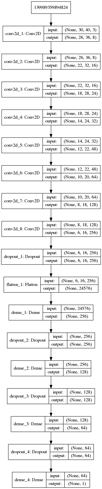

# Models

## Model001

```
Layer (type)                 Output Shape              Param #   
=================================================================
conv2d_1 (Conv2D)            (None, 26, 36, 8)         608       
_________________________________________________________________
conv2d_2 (Conv2D)            (None, 22, 32, 16)        3216      
_________________________________________________________________
conv2d_3 (Conv2D)            (None, 18, 28, 24)        9624      
_________________________________________________________________
conv2d_4 (Conv2D)            (None, 14, 24, 32)        19232     
_________________________________________________________________
conv2d_5 (Conv2D)            (None, 12, 22, 48)        13872     
_________________________________________________________________
conv2d_6 (Conv2D)            (None, 10, 20, 64)        27712     
_________________________________________________________________
conv2d_7 (Conv2D)            (None, 8, 18, 128)        73856     
_________________________________________________________________
conv2d_8 (Conv2D)            (None, 6, 16, 256)        295168    
_________________________________________________________________
dropout_1 (Dropout)          (None, 6, 16, 256)        0         
_________________________________________________________________
flatten_1 (Flatten)          (None, 24576)             0         
_________________________________________________________________
dense_1 (Dense)              (None, 256)               6291712   
_________________________________________________________________
dropout_2 (Dropout)          (None, 256)               0         
_________________________________________________________________
dense_2 (Dense)              (None, 128)               32896     
_________________________________________________________________
dropout_3 (Dropout)          (None, 128)               0         
_________________________________________________________________
dense_3 (Dense)              (None, 64)                8256      
_________________________________________________________________
dropout_4 (Dropout)          (None, 64)                0         
_________________________________________________________________
dense_4 (Dense)              (None, 1)                 65        
=================================================================
Total params: 6,776,217
Trainable params: 6,776,217
Non-trainable params: 0

```


